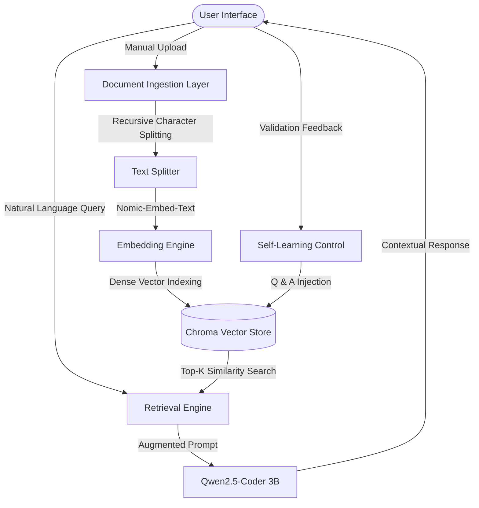

# Inertia-Local-RAG
**Course:** Advanced Database Systems (CSAI 302)  
**Date:** December 23, 2025  

---

## 👥 Team Members
| Name | Student ID |
| :--- | :--- |
| **Amr Yasser** | 202301043 |
| **Mohamed Ehab** | 202201368 |
| **Ahmed Abbas** | 202300604 |

---

## 1. Executive Summary
This project implements a state-of-the-art **Retrieval-Augmented Generation (RAG)** system designed for high-precision information extraction from unstructured datasets. Developed for the *Advanced Database Systems* course, the system emphasizes data sovereignty, local inference, and dynamic knowledge injection. By leveraging a high-performance vector database layer and a quantized Large Language Model (LLM), we provide a solution that eliminates LLM hallucinations while maintaining strict data privacy.

---

## 2. System Architecture & Flow
The architecture is built upon a decoupled pipeline where storage, retrieval, and generation are distinct yet highly integrated layers.

### Technical Workflow:
1.  **Ingestion & Chunking:** Processes raw text using a recursive splitter with 800-character windows and 12.5% overlap (100 chars) to ensure no loss of semantic context at boundaries.
2.  **Vectorization:** Utilizes the `nomic-embed-text` model to transform chunks into a high-dimensional vector space.
3.  **Advanced Retrieval:** Employs **Cosine Similarity** to navigate the vector space and retrieve the $k=3$ most relevant documents.
4.  **Grounded Generation:** The `qwen2.5-coder:3b` model receives the query wrapped in a system prompt that mandates strict adherence to the retrieved context.

---

## 3. Design Choices & Justification

| Component | Selection | Engineering Rationale |
| :--- | :--- | :--- |
| **Vector DB** | **ChromaDB** | Chosen for its lightweight footprint and persistent storage capabilities. It allows for efficient indexing and querying of dense vectors without the overhead of heavy enterprise databases. |
| **Embedding** | **Nomic-Embed-Text** | Highly optimized for long-context retrieval. It provides superior semantic representation compared to older BERT-based models, fitting the "Advanced Database" requirement for high-fidelity indexing. |
| **LLM** | **Qwen2.5-Coder 3B** | A deep-learning model with high reasoning capacity relative to its 3-billion parameter count. Supports local inference via Ollama, ensuring zero-latency and offline operation. |
| **Search Method** | **Cosine Similarity** | Mathematically robust for comparing document orientation in high-dimensional space, effectively handling variations in sentence length and phrasing. |
| **UI Framework** | **Streamlit** | Facilitates a "Friendly UI" (Bonus) with custom CSS injection to create a premium, interactive dashboard for knowledge management. |

---

## 4. Execution Examples & Verification

### **Scenario A: Knowledge Retrieval**
*   **Query:** "What is the primary function of the vector database layer?"
*   **Context Retrieved:** *"The vector database layer stores dense embeddings... allowing for semantic retrieval of relevant documentation."*
*   **Generated Answer:** The primary function is to store high-dimensional embeddings of documents. This allows the system to perform semantic searches that go beyond simple keyword matching, identifying relevant context even when the exact words differ from the query.

### **Scenario B: Self-Learning Feedback**
*   **Query:** "How is data privacy maintained?"
*   **Action:** The user validates an answer confirming 100% local processing.
*   **Learning:** The Q&A pair is injected into the ChromaDB. A subsequent search for "privacy" now retrieves this validated insight with higher confidence.

---

## 5. Strengths, Limitations, and Future Roadmap

### **Strengths**
-   **Data Sovereignty:** Operates entirely behind the firewall with no external API calls (Zero SaaS dependency).
-   **Explainability:** Every answer is backed by "Contextual Anchors" (sources), allowing users to verify facts.
-   **Scalability:** ChromaDB's local persistence allows the brain to grow as more documents are ingested.

### **Limitations**
-   **I/O Constraints:** Performance is tied to local GPU/NPU availability.
-   **Format Scope:** Currently optimized for UTF-8 textual data.

### **Advanced Improvements (Next Steps)**
-   **Hybrid Search:** Integrating BM25 keyword search with Vector search to improve retrieval of rare technical terms.
-   **Knowledge Graphs:** Mapping relationships between retrieved entities to provide deeper relational insights.
-   **Query Expansion:** Using the LLM to rewrite user queries into more searchable technical formats.

---
*This documentation serves as a complete record of the design and implementation for Project Assignment: Vector Database.*
